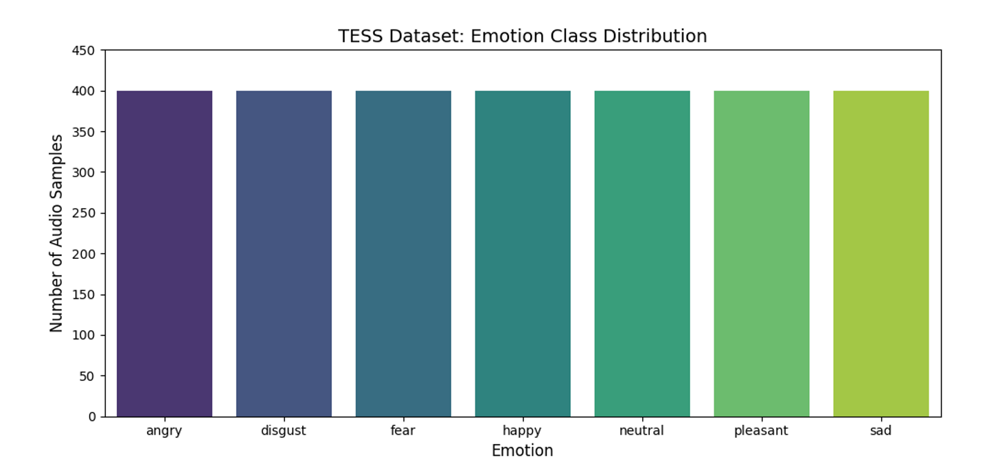

# 🎭 Multimodal Emotion Recognition (Speech + Text Fusion)

## 📖 Description

This project implements a **Multimodal Emotion Recognition System** capable of predicting human emotions using **speech-only, text-only, and combined speech-text inputs**.  

The system classifies emotions into seven categories: **Angry, Disgust, Fear, Happy, Neutral, Pleasant Surprise, and Sad**.

The repository contains three independent deep learning pipelines:

- 🎙️ **Speech-Only Model** — learns emotional patterns from acoustic speech features such as tone, pitch, and prosody.
- 📝 **Text-Only Model** — analyzes emotional meaning from the semantic and contextual understanding of transcribed text.
- 🔀 **Multimodal Fusion Model** — combines both speech and text representations to achieve stronger and more robust emotion recognition.

The project also includes **representation learning analysis, t-SNE visualization, confusion matrices, and error analysis** to study the effectiveness of multimodal learning.

## 📊 Dataset

The models are trained and evaluated on the **TESS (Toronto Emotional Speech Set)** dataset.

- **Dataset Link:** [TESS Dataset](https://www.kaggle.com/datasets/ejlok1/toronto-emotional-speech-set-tess)

- **Emotion Distribution:**

<p align="center">
  
</p>

---

### Dataset Overview

- Consists of **2,800 speech samples** recorded by two actresses aged **26** and **64**.
- Balanced across **7 emotional categories**:
  - Angry
  - Disgust
  - Fear
  - Happy
  - Neutral
  - Pleasant Surprise
  - Sad

---

### Linguistic Structure

The dataset uses linguistically neutral carrier phrases such as:

> *“Say the word door”*  
> *“Say the word neat”*

All emotional categories contain the same spoken sentences, ensuring that emotional variation primarily comes from vocal expression rather than changes in textual content.

---

### Data Split

The dataset is divided using an **80% Training / 20% Testing** split while maintaining balanced emotion distributions during evaluation.


## 📦 Data Extraction & Splitting

The TESS dataset was extracted and processed using custom preprocessing scripts developed in Google Colab.

---

### 🔓 Data Extraction

The compressed TESS dataset archive was extracted from Google Drive and verified before preprocessing.

### Extraction Pipeline

- Mounted Google Drive for dataset access
- Loaded the compressed dataset archive
- Extracted audio files using Python's `zipfile` utilities
- Verified extracted folder structure and audio contents

### Output Structure

```bash
/content/tess_dataset/
└── TESS Toronto emotional speech set data/


```
### ✂️ Data Splitting

After dataset extraction, the complete TESS dataset was recursively processed to generate structured metadata for multimodal training and testing.

The preprocessing pipeline created paired speech-text samples by extracting:

- Relative audio file paths
- Reconstructed text transcripts
- Encoded emotion labels

---

### 📝 Transcript Generation

The TESS dataset only contains audio files and does not provide separate text transcripts.  
Since the dataset follows fixed sentence patterns, text transcripts were generated directly from the audio filenames.

Example filename:

```text
YAF_back_angry.wav
```

This filename contains:

- `YAF` → Speaker ID  
- `back` → Spoken word  
- `angry` → Emotion label  

The preprocessing pipeline extracts the spoken word from the filename and reconstructs the transcript:

```python
word = name_parts[1].lower()
text_phrase = f"say the word {word}"
```

Generated transcript:

```text
YAF_back_angry.wav → "say the word back"
```

This generated text was used as input for:

- Text-Only Model
- Multimodal Fusion Model

### Example Speech-Text Pairs

| Audio File | Generated Text |
|---|---|
| YAF_back_angry.wav | say the word back |
| YAF_door_happy.wav | say the word door |

---

### 🏷️ Emotion Label Encoding

Each emotion category was mapped into a numerical label for model training.

| Emotion | Label |
|---|---|
| Angry | 0 |
| Disgust | 1 |
| Fear | 2 |
| Happy | 3 |
| Neutral | 4 |
| Pleasant Surprise | 5 |
| Sad | 6 |

---

### 📊 Train-Test Split

The complete dataset was divided into:

- **80% Training Data**
- **20% Testing Data**

using a fixed random seed for reproducibility.

The split preserved balanced emotion distributions across both datasets to ensure fair evaluation for all emotion classes.

---

### 💾 Generated CSV Files

The splitting pipeline generated two structured CSV files:

```bash
Data_split/
├── train_split.csv
└── test_split.csv
```

### train_split.csv
Contains all training samples used for:

- Model learning
- Feature extraction
- Parameter optimization

### test_split.csv
Contains unseen testing samples used for:

- Final evaluation
- Accuracy measurement
- Generalization analysis

---

### 📁 CSV Structure

Each CSV file contains the following columns:

| Column | Description |
|---|---|
| path | Relative path to audio sample |
| text | Generated text transcript |
| label_encoded | Numerical emotion label |

---

### 📌 Example CSV Entry

| path | text | label_encoded |
|---|---|---|
| YAF_angry/YAF_back_angry.wav | say the word back | 0 |

---

### ✅ Outcome

The final preprocessing pipeline produced a clean and reproducible multimodal dataset structure suitable for:

- Speech Emotion Recognition
- Text Emotion Recognition
- Multimodal Fusion Training
