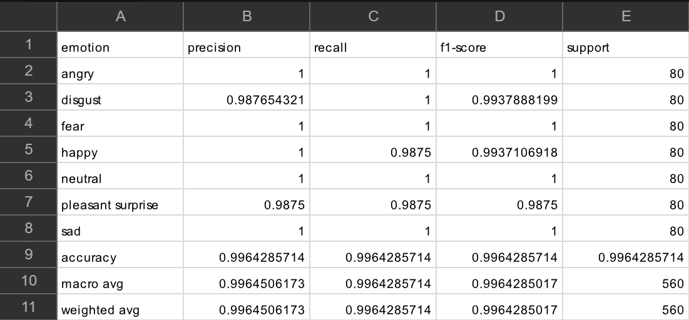
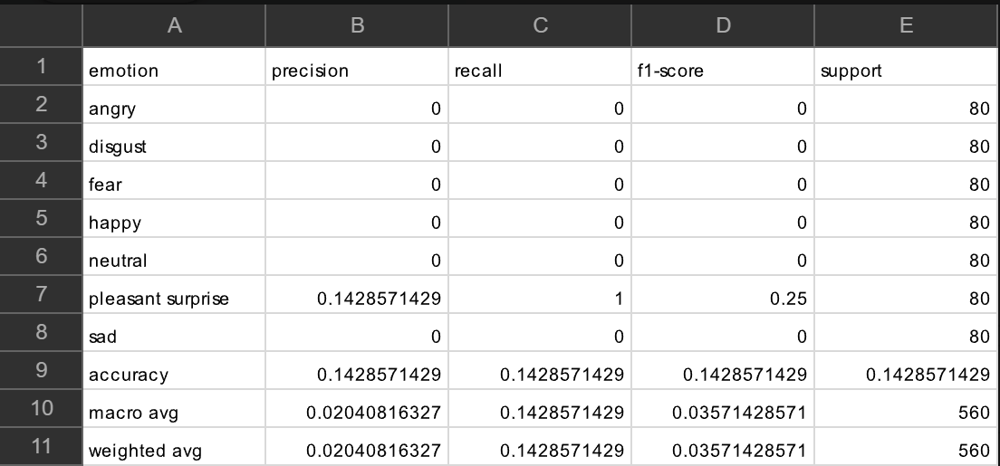
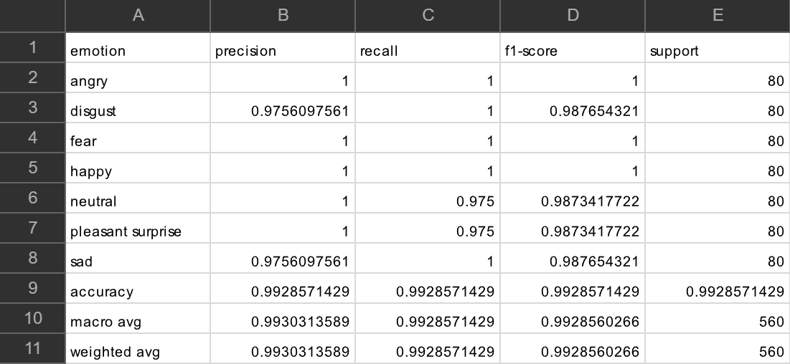

# 🎭 Multimodal Emotion Recognition (Speech and Text)

## 📖 Description

This project implements a **Multimodal Emotion Recognition System** capable of predicting human emotions using **speech-only, text-only, and combined speech-text inputs**.  

The system classifies emotions into seven categories: **Angry, Disgust, Fear, Happy, Neutral, Pleasant Surprise, and Sad**.

The repository contains three independent deep learning pipelines:

- 🎙️ **Speech-Only Model** — learns emotional patterns from acoustic speech features such as tone, pitch, and prosody.
- 📝 **Text-Only Model** — analyzes emotional meaning from the semantic and contextual understanding of transcribed text.
- 🔀 **Multimodal Fusion Model** — combines both speech and text representations to achieve stronger and more robust emotion recognition.

The project also includes **representation learning analysis, t-SNE visualization, confusion matrices, and error analysis** to study the effectiveness of multimodal learning.

## 🧠 Model Overview

| Model | Input Modality | Main Backbone |
|---|---|---|
| Speech-Only | Audio | HuBERT + MFCC + BiLSTM |
| Text-Only | Text | DistilBERT |
| Multimodal Fusion | Audio + Text | HuBERT + MFCC + BiLSTM + DistilBERT |

## 📊 Dataset

The models are trained and evaluated on the **TESS (Toronto Emotional Speech Set)** dataset.

- **Dataset Link:** [TESS Dataset](https://www.kaggle.com/datasets/ejlok1/toronto-emotional-speech-set-tess)

- **Emotion Distribution:**

<p align="center">
  
</p>

---

### Dataset Overview

- Consists of **2,800 speech samples** recorded by two actresses aged **26** and **64**.
- Balanced across **7 emotional categories**:
  - Angry
  - Disgust
  - Fear
  - Happy
  - Neutral
  - Pleasant Surprise
  - Sad

---

### Linguistic Structure

The dataset uses linguistically neutral carrier phrases such as:

> *“Say the word door”*  
> *“Say the word neat”*

All emotional categories contain the same spoken sentences, ensuring that emotional variation primarily comes from vocal expression rather than changes in textual content.


## 📦 Data Extraction & Splitting

The TESS dataset was extracted and processed using custom preprocessing scripts developed in Google Colab.

<p align="center">
  
</p>

---

### 🔓 Data Extraction

The compressed TESS dataset archive was extracted from Google Drive and verified before preprocessing.

#### Extraction Pipeline

- Mounted Google Drive for dataset access
- Loaded the compressed dataset archive
- Extracted audio files using Python's `zipfile` utilities
- Verified extracted folder structure and audio contents

#### Output Structure

```bash
/content/tess_dataset/
└── TESS Toronto emotional speech set data/


```
### ✂️ Data Splitting

After dataset extraction, the complete TESS dataset was recursively processed to generate structured metadata for multimodal training and testing.

The preprocessing pipeline created paired speech-text samples by extracting:

- Relative audio file paths
- Reconstructed text transcripts
- Encoded emotion labels

---

#### 📝 Transcript Generation

The TESS dataset only contains audio files and does not provide separate text transcripts.  
Since the dataset follows fixed sentence patterns, text transcripts were generated directly from the audio filenames.

Example filename:

```text
YAF_back_angry.wav
```

This filename contains:

- `YAF` → Speaker ID  
- `back` → Spoken word  
- `angry` → Emotion label  

The preprocessing pipeline extracts the spoken word from the filename and reconstructs the transcript:

```python
word = name_parts[1].lower()
text_phrase = f"say the word {word}"
```

Generated transcript:

```text
YAF_back_angry.wav → "say the word back"
```

This generated text was used as input for:

- Text-Only Model
- Multimodal Fusion Model

#### Example Speech-Text Pairs

| Audio File | Generated Text |
|---|---|
| YAF_back_angry.wav | say the word back |
| YAF_door_happy.wav | say the word door |

---

#### 🏷️ Emotion Label Encoding

Each emotion category was mapped into a numerical label for model training.

| Emotion | Label |
|---|---|
| Angry | 0 |
| Disgust | 1 |
| Fear | 2 |
| Happy | 3 |
| Neutral | 4 |
| Pleasant Surprise | 5 |
| Sad | 6 |

---

#### 📊 Train-Test Split

The complete dataset was divided into:

- **80% Training Data**
- **20% Testing Data**

using a fixed random seed for reproducibility.

The split preserved balanced emotion distributions across both datasets to ensure fair evaluation for all emotion classes.

---

#### 💾 Generated CSV Files

The splitting pipeline generated two structured CSV files:

```bash
Data_split/
├── train_split.csv
└── test_split.csv
```

#### train_split.csv
Contains all training samples used for:

- Model learning
- Feature extraction
- Parameter optimization

#### test_split.csv
Contains unseen testing samples used for:

- Final evaluation
- Accuracy measurement
- Generalization analysis

---

#### 📁 CSV Structure

Each CSV file contains the following columns:

| Column | Description |
|---|---|
| path | Relative path to audio sample |
| text | Generated text transcript |
| label_encoded | Numerical emotion label |

---

#### 📌 Example CSV Entry

| path | text | label_encoded |
|---|---|---|
| YAF_angry/YAF_back_angry.wav | say the word back | 0 |

---

#### ✅ Outcome

The final preprocessing pipeline produced a clean and reproducible multimodal dataset structure suitable for:

- Speech Emotion Recognition
- Text Emotion Recognition
- Multimodal Fusion Training


## 🧠 Models

This project consists of three independent deep learning pipelines:

### 🎙️ 1. Speech-Only Model

The Speech-Only pipeline predicts emotions directly from raw audio signals by learning acoustic speech features such as tone, pitch, energy, etc.

---

#### 🏗️ a. System Architecture

The Speech-Only architecture predicts emotions directly from raw speech audio by combining pretrained contextual speech embeddings, handcrafted acoustic features, and temporal sequence modeling.

<p align="center">
  
</p>

---

##### 🔊 1. Preprocessing

The model receives raw speech audio samples as input.

Each audio sample undergoes multiple preprocessing operations before feature extraction:

- Audio loading using `librosa`
- Silence trimming
- Fixed-length padding/truncation
- Sample rate normalization

To ensure consistent batch processing, all audio samples are standardized to a fixed duration and sampling rate.

---

##### 🎼 2. Feature Extraction

The architecture extracts two complementary speech representations simultaneously.

##### a. HuBERT Contextual Speech Embeddings

The raw waveform is passed through a pretrained **HuBERT (`facebook/hubert-base-ls960`)** model.

HuBERT generates high-dimensional contextual speech embeddings that capture:

- Speech context
- Prosody
- Temporal speech structure
- High-level acoustic semantics
- Phonetic and emotional speech patterns

The pretrained HuBERT weights are frozen during training to preserve learned speech representations and reduce computational overhead.

---

##### b. MFCC Acoustic Features

In parallel, MFCC (Mel-Frequency Cepstral Coefficient) features are extracted using `librosa`.

MFCC features capture low-level acoustic characteristics such as:

- Pitch
- Tone
- Frequency distribution
- Spectral variations
- Vocal tract characteristics

These handcrafted acoustic descriptors complement the contextual HuBERT representations.

---

##### c. Feature Fusion

The HuBERT embeddings and MFCC acoustic features are concatenated together along the feature dimension to create a unified speech representation.

This fusion mechanism enables the architecture to simultaneously learn from:

- Deep contextual speech representations
- Traditional handcrafted acoustic features

The fused representation provides richer emotional information compared to using either representation independently.

---

##### ⏳ 3. Temporal Modelling

The combined speech representation is passed through a **Bidirectional Long Short-Term Memory (BiLSTM)** network.

The BiLSTM models sequential emotional dependencies across speech frames and learns temporal speech dynamics such as:

- Emotional transitions
- Speaking rhythm
- Temporal prosodic variations
- Sequential acoustic patterns

Bidirectional processing allows the network to capture contextual dependencies from both forward and backward directions in the speech sequence.

---

##### 🌐 4. Temporal Pooling

After BiLSTM processing, global temporal pooling is applied across all time steps.

This operation compresses the sequential BiLSTM outputs into a compact fixed-dimensional emotional embedding representing the overall emotional characteristics of the speech sample.

---

##### 🎯 5. Classification

The pooled emotional embedding is passed through a fully connected classification head consisting of:

- Linear Layers
- Layer Normalization
- ReLU Activation
- Dropout Regularization

The classifier predicts one of the following seven emotional categories:

| Emotion | Label |
|---|---|
| Angry | 0 |
| Disgust | 1 |
| Fear | 2 |
| Happy | 3 |
| Neutral | 4 |
| Pleasant Surprise | 5 |
| Sad | 6 |

---

##### 📤 6. Final Emotion Prediction

The final output of the architecture is a probability distribution across all emotion classes.

The emotion with the highest probability score is selected as the predicted emotional state of the input speech sample.

---

#### 🏋️ b. Training Pipeline

The Speech-Only training pipeline learns emotional representations directly from speech signals using supervised deep learning.

The complete training workflow includes:

- Dataset loading
- Audio preprocessing
- Acoustic feature extraction
- Temporal sequence learning
- Emotion classification
- Validation monitoring
- Checkpoint saving

---

##### 📂 Dataset Loading

Training samples are loaded from:

```bash
Data_split/train_split.csv
```

The CSV file contains:

| Column | Description |
|---|---|
| path | Relative audio file path |
| text | Generated transcript |
| label_encoded | Numerical emotion label |

The dataset is loaded using the custom `TESSSpeechDataset` class implemented in PyTorch.

---

##### ✂️ Training–Validation Split

The original training dataset is further divided into:

- Training Set
- Validation Set

using:

```python
train_test_split()
```

with stratified sampling to preserve balanced emotion distributions across both subsets.

The validation dataset is used to:

- Monitor generalization performance
- Track validation accuracy
- Prevent overfitting
- Save the best-performing model weights

---

##### 🔊 Audio Preprocessing

Before feature extraction, every audio sample undergoes multiple preprocessing stages.

The preprocessing pipeline performs:

- Audio loading using `librosa`
- Silence trimming
- Fixed-length padding/truncation
- Sample rate normalization
- MFCC feature extraction preparation

All speech samples are standardized to a fixed duration to ensure consistent batch processing during training.

---

##### 🎼 Feature Preparation

For each audio sample, the training pipeline generates two complementary speech representations.

##### 1. Raw Waveform Input

The raw speech waveform is directly passed into the pretrained HuBERT encoder for contextual speech representation learning.

##### 2. MFCC Acoustic Features

MFCC features are extracted using:

```python
librosa.feature.mfcc()
```

These features capture low-level acoustic properties such as:

- Pitch
- Tone
- Spectral characteristics
- Frequency distribution

The extracted MFCC features are later fused with contextual HuBERT embeddings inside the architecture.

---

##### 🔗 Batch Loading Pipeline

The processed samples are loaded using PyTorch `DataLoader` objects.

Two separate data loaders are created:

- Training Loader
- Validation Loader

```python
train_loader = DataLoader(...)
val_loader = DataLoader(...)
```

The training loader uses shuffled batches for randomized learning, while the validation loader preserves deterministic ordering during evaluation.

---

##### 🧠 Forward Propagation

During each training iteration:

1. Raw audio is passed through the pretrained HuBERT encoder
2. MFCC acoustic features are extracted
3. Both feature representations are fused together
4. The fused representation passes through BiLSTM layers
5. Temporal pooling generates compact emotional embeddings
6. The classifier predicts emotion probabilities

The final output is a probability distribution across all emotion classes.

---

##### 📉 Loss Function

The training pipeline uses:

```python
CrossEntropyLoss()
```

to measure prediction error between:

- Predicted emotion probabilities
- Ground-truth emotion labels

This loss function is suitable for multi-class emotion classification tasks.

---

##### ⚙️ Optimization Strategy

The model parameters are optimized using:

```python
torch.optim.AdamW()
```

The optimizer updates trainable parameters using gradient-based backpropagation.

Training configuration:

| Parameter | Value |
|---|---|
| Learning Rate | `1e-4` |
| Weight Decay | `1e-2` |
| Batch Size | `32` |
| Epochs | `10` |

---

##### 🔄 Backpropagation & Parameter Updates

For every training batch:

1. Forward propagation is performed
2. Loss is computed
3. Gradients are calculated using backpropagation
4. Optimizer updates trainable model parameters

The pipeline continuously minimizes training loss across epochs to improve emotional classification performance.

---

##### 📈 Validation Monitoring

After each epoch, the model is evaluated on the validation dataset.

The training pipeline tracks:

- Training Loss
- Validation Loss
- Training Accuracy
- Validation Accuracy

These metrics help analyze:

- Model convergence
- Generalization capability
- Overfitting behavior

---

##### 💾 Best Model Checkpoint Saving

The pipeline automatically saves the best-performing model weights based on validation accuracy.

Saved file:

```bash
best_speech_model.pth
```

Storage location:

```bash
IIIT_project/
└── best_speech_model.pth
```

This checkpoint stores the learned parameters of the Speech-Only architecture and is later used during testing and inference.

---

##### 📊 Learning Curve Generation

During training, learning curves are automatically generated for:

- Loss Profiles
- Accuracy Profiles

Generated output:

```bash
IIIT_project/
└── Results/
    └── plots/
        └── Speech_model/
            └── learning_curves.png
```

The generated plots visualize training convergence, validation stability, and overall learning behavior across training epochs.

<p align="center">
  
</p>

The learning curves show rapid convergence with consistently low validation loss and high validation accuracy, indicating stable training and strong generalization performance on unseen validation samples.

---

##### ✅ Final Outcome

The Speech-Only training pipeline learns robust emotional speech representations by combining:

- Contextual speech embeddings
- Handcrafted acoustic features
- Temporal sequence modeling

to perform high-accuracy speech emotion recognition.

---


#### 📊 c. Testing & Evaluation Pipeline

The Speech-Only evaluation pipeline measures the model’s ability to generalize on unseen speech samples using multiple quantitative and visualization-based evaluation techniques.

The testing workflow includes:

- Test dataset loading
- Model checkpoint loading
- Inference generation
- Accuracy metric computation
- Confusion matrix generation
- t-SNE latent space visualization
- Performance report export

---

##### 📂 Test Dataset Loading

Evaluation samples are loaded from:

```bash
Data_split/test_split.csv
```

The testing pipeline uses the same `TESSSpeechDataset` preprocessing pipeline used during training to ensure consistent feature generation and inference behavior.

The test loader processes samples in deterministic order using:

```python
DataLoader(..., shuffle=False)
```

to preserve stable evaluation consistency.

---

##### 💾 Loading Trained Weights

The trained Speech-Only model weights are loaded from:

```bash
best_speech_model.pth
```

Storage location:

```bash
IIIT_project/
└── best_speech_model.pth
```

The checkpoint stores the learned parameters obtained during validation-based training.

---

##### 🧠 Inference Pipeline

During evaluation:

1. Raw speech audio is loaded
2. HuBERT embeddings are extracted
3. MFCC acoustic features are generated
4. Both feature representations are fused
5. The fused representation passes through the BiLSTM network
6. Temporal pooling generates emotional embeddings
7. The classifier predicts final emotion probabilities

The predicted emotion corresponds to the class with the highest probability score.

---

##### 📈 Classification Metrics

The evaluation pipeline computes detailed classification metrics using:

```python
classification_report()
```

The generated metrics include:

- Precision
- Recall
- F1-Score
- Overall Accuracy
- Macro Average
- Weighted Average

Generated output:

```bash
IIIT_project/
└── Results/
    └── speech_accuracy_table.csv
```

<p align="center">
  
</p>

The Speech-Only model achieved an overall test accuracy of approximately **99.64%** on unseen evaluation samples, demonstrating highly robust emotional speech classification performance.

---

##### 🔥 Confusion Matrix Analysis

A confusion matrix is generated using:

```python
confusion_matrix()
```

to visualize class-wise prediction performance and misclassification behavior.

Generated output:

```bash
IIIT_project/
└── Results/
    └── plots/
        └── Speech_model/
            └── confusion_matrix.png
```

<p align="center">
  
</p>

The confusion matrix shows near-perfect class separation across all seven emotional categories, with only minimal confusion observed between emotionally similar speech classes.

---

##### 🌌 t-SNE Latent Space Visualization

The learned BiLSTM emotional embeddings are projected into 2D space using:

```python
TSNE()
```

to visualize how effectively the model separates emotional speech representations in latent feature space.

Generated output:

```bash
IIIT_project/
└── Results/
    └── plots/
        └── Speech_model/
            └── tsne.png
```

<p align="center">
  
</p>

The t-SNE visualization demonstrates strong inter-class separability, where emotionally distinct speech samples form highly compact and well-separated clusters in latent space.

---

##### 📊 Evaluation Summary

The Speech-Only evaluation pipeline demonstrates that the architecture successfully learns highly discriminative emotional speech representations using:

- Contextual HuBERT embeddings
- MFCC acoustic features
- Temporal BiLSTM sequence modeling

The near-perfect classification metrics and clearly separated latent clusters indicate strong generalization capability on unseen emotional speech samples.

### 📝 Text-Only Model

The Text-Only pipeline predicts emotions using text.

It learns semantic and contextual language representations directly from textual input using a pretrained transformer-based language model.

---
#### 🏗️ a. System Architecture

The Text-Only architecture performs emotion classification using pretrained transformer-based contextual language embeddings generated by DistilBERT.

<p align="center">
  
</p>

---

##### 📝 1. Preprocessing

The model receives textual input sequences representing speech transcripts.

Example:

```text
"say the word back"
```

The text preprocessing pipeline performs:

- Text tokenization
- Attention mask generation
- Sequence padding
- Sequence truncation

All text sequences are converted into fixed-length transformer-compatible representations for consistent batch processing.

---

##### 🔤 2. Feature Extraction

The input text is tokenized using the pretrained:

```python
DistilBertTokenizer.from_pretrained('distilbert-base-uncased')
```

tokenizer.

The tokenizer converts raw text into transformer-compatible representations including:

- Input Token IDs
- Attention Masks
- Special Tokens (`[CLS]`, `[SEP]`)

These tokenized representations serve as inputs to the transformer encoder.

---

##### 🧠 3. Contextual Modelling

The tokenized text is passed through a pretrained:

```python
DistilBertModel('distilbert-base-uncased')
```

transformer language model.

DistilBERT generates high-dimensional contextual embeddings that capture:

- Linguistic structure
- Word relationships
- Contextual semantics
- Transformer attention dependencies
- Sentence-level semantic representations

The pretrained DistilBERT parameters are frozen during training to preserve learned language knowledge and reduce computational complexity.

---

##### 🌐 4. CLS Sentence Representation

After transformer encoding, the architecture extracts the contextual embedding corresponding to the `[CLS]` token:

```python
outputs.last_hidden_state[:, 0, :]
```

The CLS embedding acts as a compact sentence-level representation summarizing the semantic meaning of the entire input sequence.

---

##### 🎯 5. Classification

The CLS embedding is passed through a fully connected classification head consisting of:

- Linear Layers
- Layer Normalization
- ReLU Activation
- Dropout Regularization

The classifier predicts one of the following seven emotional categories:

| Emotion | Label |
|---|---|
| Angry | 0 |
| Disgust | 1 |
| Fear | 2 |
| Happy | 3 |
| Neutral | 4 |
| Pleasant Surprise | 5 |
| Sad | 6 |

---

##### 📤 6. Final Emotion Prediction

The final output of the architecture is a probability distribution across all emotional categories.

The emotion with the highest probability score is selected as the predicted emotional state of the input text sequence.

---

#### 🏋️ b. Training Pipeline

The Text-Only training pipeline learns emotional representations directly from textual input using pretrained transformer-based contextual embeddings generated by DistilBERT.

---

##### 📂 Dataset Loading

Training samples are loaded from:

```bash
Data_split/train_split.csv
```

The CSV file contains:

| Column | Description |
|---|---|
| path | Relative audio file path |
| text | Generated transcript |
| label_encoded | Numerical emotion label |

The complete training dataset is further divided into:

- Training Set
- Validation Set

using Scikit-learn’s:

```python
train_test_split()
```

utility with:

- **15% validation split**
- **Stratified class balancing**
- **Random state = 42**

This ensures balanced emotional category distributions during training and validation.

---

##### 📝 Text Preprocessing

The textual transcripts are processed using the pretrained:

```python
DistilBertTokenizer.from_pretrained('distilbert-base-uncased')
```

tokenizer.

Each text sample undergoes:

- Tokenization
- Attention mask generation
- Sequence padding
- Sequence truncation

All sequences are converted into fixed-length transformer-compatible inputs before training.

---

##### 📦 DataLoader Pipeline

The processed text samples are loaded using custom:

```python
TESSTextDataset
```

dataset and PyTorch `DataLoader` pipelines.

Training configuration:

```python
batch_size = 32
shuffle = True
```

Validation configuration:

```python
batch_size = 32
shuffle = False
```

The shuffled training loader improves generalization while deterministic validation loading ensures stable evaluation consistency.

---

##### 🧠 Transformer Feature Extraction

The architecture uses pretrained:

```python
DistilBertModel('distilbert-base-uncased')
```

contextual language embeddings for semantic feature extraction.

During training:

- Transformer parameters are frozen
- Only the classification head is optimized

This significantly reduces computational cost while preserving pretrained language knowledge.

The extracted CLS embeddings act as compact sentence-level semantic representations for emotion classification.

---

##### 🔗 Classification Head Training

The CLS semantic embeddings are passed through a fully connected classification head consisting of:

- Linear Layers
- Layer Normalization
- ReLU Activation
- Dropout Regularization

The classifier learns mappings between semantic text representations and emotional categories.

---

##### ⚙️ Optimization Strategy

The training pipeline uses:

- **AdamW Optimizer**
- **CrossEntropy Loss**
- **Weight Decay Regularization**
- **Validation-based Checkpoint Saving**

Optimization configuration:

```python
learning_rate = 5e-4
weight_decay = 1e-2
epochs = 15
```

Only the classifier parameters are updated during optimization while DistilBERT remains frozen.

---

##### 💾 Best Model Checkpoint Saving

The best-performing model weights are automatically saved based on validation accuracy improvements.

Generated output:

```bash
IIIT_project/
└── best_text_model.pth
```

This checkpoint stores the learned parameters of the Text-Only emotion classification model and is later loaded during evaluation and inference.

---

##### 📈 Training Monitoring

During training, the pipeline continuously tracks:

- Training Loss
- Validation Loss
- Training Accuracy
- Validation Accuracy

These metrics are stored epoch-wise for convergence analysis and performance monitoring.

---

##### 📊 Learning Curve Generation

Learning curves are automatically generated to visualize:

- Loss Profiles
- Accuracy Profiles
- Validation Stability
- Training Convergence Behavior

Generated output:

```bash
IIIT_project/
└── Results/
    └── plots/
        └── Text_model/
            └── learning_curves.png
```

<p align="center">
  
</p>

The learning curves demonstrate extremely limited convergence and consistently low validation accuracy, highlighting the difficulty of performing emotion recognition using only semantic textual information from the TESS dataset.

This behavior occurs because the TESS dataset uses nearly identical carrier phrases across all emotional categories, providing minimal emotion-specific semantic variation for the transformer model to learn.

---

#### 📊 Testing & Evaluation Pipeline

The Text-Only evaluation pipeline measures the model’s ability to generalize on unseen textual inputs using quantitative metrics and latent space visualization techniques.

The evaluation workflow includes:

- Test dataset loading
- Model checkpoint loading
- Transformer inference
- Accuracy metric computation
- Confusion matrix generation
- t-SNE latent space visualization

---

##### 📂 Test Dataset Loading

Evaluation samples are loaded from:

```bash
Data_split/test_split.csv
```

using:

```python
pd.read_csv()
```

The testing pipeline uses the same `TESSTextDataset` preprocessing pipeline used during training to ensure consistent tokenization and transformer input generation.

The test loader processes samples using:

```python
DataLoader(..., shuffle=False)
```

to preserve deterministic evaluation consistency.

---

##### 💾 Loading Trained Weights

The trained Text-Only model weights are loaded from:

```bash
best_text_model.pth
```

Storage location:

```bash
IIIT_project/
└── best_text_model.pth
```

The checkpoint stores the learned parameters of the Text-Only classification model obtained during validation-based training.

---

##### 🧠 Transformer Inference Pipeline

During evaluation:

1. Input text is tokenized
2. Attention masks are generated
3. DistilBERT contextual embeddings are extracted
4. CLS token embeddings are generated
5. The classification head predicts emotional probabilities

The predicted emotion corresponds to the class with the highest probability score.

---

##### 📈 Classification Metrics

The evaluation pipeline computes detailed classification metrics using:

```python
classification_report()
```

The generated metrics include:

- Precision
- Recall
- F1-Score
- Overall Accuracy
- Macro Average
- Weighted Average

Generated output:

```bash
IIIT_project/
└── Results/
    └── text_accuracy_table.csv
```

<p align="center">
  
</p>

The Text-Only model achieved an overall test accuracy of approximately **14.28%**, with extremely low precision, recall, and F1-scores across most emotional categories.

This performance is close to random guessing across seven classes, indicating that semantic text information alone is insufficient for reliable emotion recognition in the TESS dataset.

---

##### 🔥 Confusion Matrix Analysis

A confusion matrix is generated using:

```python
confusion_matrix()
```

to visualize class-wise prediction behavior and semantic confusion patterns.

Generated output:

```bash
IIIT_project/
└── Results/
    └── plots/
        └── Text_model/
            └── confusion_matrix.png
```

<p align="center">
  
</p>

The confusion matrix shows severe prediction collapse, where the model predicts nearly all samples as a single emotional category.

This indicates that the transformer model was unable to learn discriminative semantic representations for different emotions.

---

##### 🌌 t-SNE Latent Space Visualization

The learned DistilBERT semantic embeddings are projected into 2D space using:

```python
TSNE()
```

to visualize latent feature separability across emotional categories.

Generated output:

```bash
IIIT_project/
└── Results/
    └── plots/
        └── Text_model/
            └── tsne.png
```

<p align="center">
  
</p>

The t-SNE visualization shows highly overlapping emotional representations with no clearly separable clusters.

Unlike the Speech-Only model, the semantic embeddings fail to organize into meaningful emotional groupings in latent space.

---

##### ⚠️ Failure Analysis

The Text-Only model demonstrated extremely poor generalization performance on the TESS dataset because the dataset provides very limited emotion-specific semantic information.

The TESS dataset uses identical carrier phrases across all emotional categories.

For example, the sentence:

```text
"say the word back"
```

appears in all seven emotions:

- Angry
- Disgust
- Fear
- Happy
- Neutral
- Pleasant Surprise
- Sad

with only the vocal delivery changing.

As a result:

- The textual modality contains minimal emotional variance
- DistilBERT cannot learn meaningful semantic emotion separation
- The model collapses toward dominant prediction behavior
- Latent representations fail to form separable emotional clusters

This behavior demonstrates a major limitation of standalone semantic emotion recognition and highlights the critical importance of acoustic speech information for understanding human emotions in the TESS dataset.

---

##### 📊 Evaluation Summary

The Text-Only evaluation pipeline demonstrates that transformer-based semantic representations alone are insufficient for robust emotion recognition on linguistically constrained datasets such as TESS.

The failure of semantic-only learning motivates the need for:

- Acoustic speech representations
- Prosodic information
- Multimodal feature fusion

for effective emotional understanding.

---

### 🔀 Multimodal Fusion Model

The Multimodal Fusion pipeline predicts emotions by jointly learning from both speech and textual representations.

Unlike the standalone Speech-Only and Text-Only architectures, this model combines acoustic speech features with contextual semantic language embeddings to create a unified multimodal emotional representation.

The fusion architecture integrates:

- Contextual speech embeddings from HuBERT
- MFCC acoustic speech features
- Transformer-based semantic text embeddings from DistilBERT

to perform robust multimodal emotion recognition.

---

#### 🏗️ a. System Architecture

The Multimodal Fusion architecture combines parallel speech and text processing branches into a unified multimodal emotional representation for final emotion classification.

<p align="center">
  
</p>

---

##### 🎙️ 1. Speech Branch

The speech branch learns emotional information directly from raw audio signals using contextual speech embeddings, handcrafted acoustic features, and temporal sequence modelling.

---

##### 🔊 1.1 Speech Preprocessing

The model receives raw speech audio samples as input.

Each audio sample undergoes multiple preprocessing operations including:

- Audio loading using `librosa`
- Silence trimming
- Fixed-length padding/truncation
- Sample rate normalization

All speech samples are standardized to a fixed duration and sampling rate to ensure consistent batch processing.

---

##### 🎼 1.2 Speech Feature Extraction

The architecture extracts two complementary speech representations simultaneously.

##### a. HuBERT Contextual Speech Embeddings

Raw speech waveforms are passed through the pretrained:

```python
HubertModel.from_pretrained("facebook/hubert-base-ls960")
```

model.

HuBERT generates contextual speech embeddings that capture:

- Prosody
- Temporal speech structure
- Acoustic context
- Emotional speech dynamics
- High-level speech semantics

The pretrained HuBERT parameters are frozen during training to preserve learned speech representations and reduce computational complexity.

---

##### b. MFCC Acoustic Features

In parallel, handcrafted MFCC (Mel-Frequency Cepstral Coefficient) features are extracted using `librosa`.

MFCC features capture low-level acoustic characteristics including:

- Pitch
- Tone
- Spectral structure
- Frequency distribution
- Vocal tract variations

These handcrafted descriptors complement the contextual HuBERT embeddings.

---

##### ⏳ 1.3 Speech Temporal Modelling

The HuBERT embeddings and MFCC features are concatenated together and passed through a Bidirectional Long Short-Term Memory (BiLSTM) network.

The BiLSTM learns temporal emotional dependencies across speech sequences including:

- Emotional transitions
- Speaking rhythm
- Prosodic variations
- Sequential acoustic patterns

Bidirectional processing allows the architecture to capture emotional information from both forward and backward temporal directions.

Global temporal pooling is then applied to generate a compact speech emotional embedding.

---

##### 📝 2. Text Branch

The text branch learns semantic emotional information using pretrained transformer-based contextual language embeddings.

---

##### 📝 2.1 Text Preprocessing

The model receives textual input sequences representing speech transcripts.

Example:

```text
"say the word back"
```

The text preprocessing pipeline performs:

- Text tokenization
- Attention mask generation
- Sequence padding
- Sequence truncation

All text sequences are converted into fixed-length transformer-compatible representations for consistent batch processing.

---

##### 🔤 2.2 Text Feature Extraction

The textual inputs are tokenized using the pretrained:

```python
DistilBertTokenizer.from_pretrained('distilbert-base-uncased')
```

tokenizer.

The tokenizer converts raw text into transformer-compatible representations including:

- Input Token IDs
- Attention Masks
- Special Tokens (`[CLS]`, `[SEP]`)

These tokenized representations serve as inputs to the transformer encoder.

---

##### 🧠 2.3 Contextual Modelling

The tokenized text is processed using the pretrained:

```python
DistilBertModel.from_pretrained('distilbert-base-uncased')
```

transformer language model.

DistilBERT generates contextual semantic embeddings that capture:

- Linguistic structure
- Contextual word relationships
- Sentence-level semantics
- Transformer attention dependencies

The pretrained DistilBERT parameters are frozen during training to preserve pretrained language knowledge and reduce computational complexity.

After transformer encoding, the architecture extracts the contextual embedding corresponding to the `[CLS]` token:

```python
outputs.last_hidden_state[:, 0, :]
```

The CLS embedding acts as a compact sentence-level semantic representation summarizing the entire input sequence.

---

##### 🔗 3. Multimodal Fusion

The pooled speech embedding and DistilBERT semantic embedding are concatenated together to form a unified multimodal emotional representation.

This fusion mechanism enables the architecture to simultaneously learn from:

- Acoustic emotional cues
- Temporal speech dynamics
- Semantic contextual information

The fused representation contains richer emotional information than either modality independently.

---

##### 🎯 4. Classification

The fused multimodal representation is passed through a fully connected classification head consisting of:

- Linear Layers
- Layer Normalization
- ReLU Activation
- Dropout Regularization

The classifier predicts one of the following seven emotional categories:

| Emotion | Label |
|---|---|
| Angry | 0 |
| Disgust | 1 |
| Fear | 2 |
| Happy | 3 |
| Neutral | 4 |
| Pleasant Surprise | 5 |
| Sad | 6 |

---

##### 📤 5. Final Emotion Prediction

The final output of the Multimodal Fusion architecture is a probability distribution across all emotional categories.

The emotion with the highest probability score is selected as the predicted emotional state by jointly analyzing both speech and textual modalities.

---

#### 🏋️ b. Training Pipeline

The Multimodal Fusion training pipeline jointly learns emotional representations from both speech and textual modalities using supervised deep learning.

The architecture combines:

- Contextual speech embeddings
- Handcrafted acoustic speech features
- Transformer-based semantic language embeddings

to create a unified multimodal emotional representation for emotion classification.

---

##### 📂 Dataset Loading

Training samples are loaded from:

```bash
Data_split/train_split.csv
```

using:

```python
pd.read_csv()
```

The CSV file contains:

| Column | Description |
|---|---|
| path | Relative audio file path |
| text | Speech transcript |
| label_encoded | Numerical emotion label |

The multimodal training pipeline simultaneously uses:

- `path` → Speech modality input
- `text` → Text modality input
- `label_encoded` → Emotion supervision label

---

##### ✂️ Training–Validation Split

The complete training dataset is further divided into:

- Training Set
- Validation Set

using Scikit-learn’s:

```python
train_test_split()
```

utility with:

- **15% validation split**
- **Stratified class balancing**
- **Random state = 42**

This preserves balanced emotional distributions across both subsets.

The validation dataset is used to:

- Monitor generalization performance
- Track validation accuracy
- Prevent overfitting
- Save the best-performing model checkpoint

---

##### 🎙️ Speech Preprocessing

Each speech sample undergoes multiple preprocessing operations before feature extraction.

The speech preprocessing pipeline performs:

- Audio loading using `librosa`
- Silence trimming
- Fixed-length padding/truncation
- Sample rate normalization
- MFCC feature extraction

Audio samples are standardized to fixed-duration waveforms for stable multimodal batch processing.

---

##### 📝 Text Preprocessing

The textual transcripts are processed using the pretrained:

```python
DistilBertTokenizer.from_pretrained('distilbert-base-uncased')
```

tokenizer.

Each text sample undergoes:

- Tokenization
- Attention mask generation
- Sequence padding
- Sequence truncation

All text sequences are converted into fixed-length transformer-compatible representations before training.

---

##### 📦 Multimodal Dataset Pipeline

The processed speech and text samples are loaded using the custom:

```python
TESSMultimodalDataset
```

dataset and PyTorch `DataLoader` pipelines.

Each training sample simultaneously contains:

- Raw speech waveform
- MFCC acoustic features
- Tokenized text embeddings
- Attention masks
- Emotion labels

Training configuration:

```python
batch_size = 32
shuffle = True
```

Validation configuration:

```python
batch_size = 32
shuffle = False
```

The shuffled training loader improves generalization, while deterministic validation loading ensures stable evaluation consistency.

---

##### 🧠 Parallel Feature Extraction

During training, the architecture extracts multimodal representations using parallel speech and text processing branches.

---

##### 1. Speech Feature Extraction

The speech branch extracts:

- Contextual HuBERT embeddings
- MFCC acoustic features

The pretrained:

```python
HubertModel.from_pretrained("facebook/hubert-base-ls960")
```

model generates contextual speech embeddings directly from raw audio waveforms.

The HuBERT parameters remain frozen during training to preserve pretrained speech knowledge and reduce computational overhead.

---

##### 2. Text Feature Extraction

The text branch extracts contextual semantic embeddings using pretrained DistilBERT.

The pretrained:

```python
DistilBertModel.from_pretrained('distilbert-base-uncased')
```

model generates transformer-based semantic language representations from textual input.

The `[CLS]` token embedding acts as the sentence-level semantic representation.

The DistilBERT parameters remain frozen during training to preserve pretrained language knowledge.

---

##### ⏳ Speech Temporal Modeling

After extracting the HuBERT embeddings and MFCC features, the combined speech representations are processed through a Bidirectional Long Short-Term Memory (BiLSTM) network.

The BiLSTM learns:

- Emotional transitions
- Sequential speech dynamics
- Temporal prosodic patterns
- Contextual acoustic dependencies

Bidirectional processing allows the network to capture emotional information from both forward and backward temporal directions.

Global temporal pooling is applied after BiLSTM processing to generate a compact, fixed-dimensional emotional speech embedding.

---

##### 🔗 Multimodal Feature Fusion (Late Fusion)

The pooled speech representation (from the BiLSTM) and the DistilBERT semantic embedding (the `[CLS]` token) are concatenated together along the feature dimension to create a unified multimodal emotional representation.

This fusion mechanism enables the architecture to jointly learn from:

- Acoustic emotional cues
- Temporal speech dynamics
- Semantic contextual information

The fused representation contains richer emotional information than either modality independently, serving as the ultimate joint-feature vector for the network.

---

##### 🎯 Emotion Classification

The final fused multimodal representation is passed through a fully connected classification head consisting of:

- Linear Layers
- Layer Normalization
- ReLU Activation
- Dropout Regularization

The classifier predicts one of the seven emotional categories.

---

##### 📉 Loss Function

The training pipeline uses:

```python
CrossEntropyLoss()
```

to measure prediction error between:

- Predicted emotion probabilities
- Ground-truth emotion labels

This loss function is suitable for multi-class multimodal emotion classification tasks.

---

##### ⚙️ Optimization Strategy

The multimodal fusion model parameters are optimized using:

```python
torch.optim.AdamW()
```

Optimization configuration:

| Parameter | Value |
|---|---|
| Learning Rate | `1e-4` |
| Weight Decay | `1e-2` |
| Batch Size | `32` |
| Epochs | `10` |

The optimizer updates trainable fusion and classification parameters using gradient-based backpropagation.

---

##### 🔄 Backpropagation & Parameter Updates

For each training batch:

1. Speech and text features are extracted
2. Speech temporal embeddings are generated
3. Semantic text embeddings are extracted
4. Multimodal features are fused
5. Emotion probabilities are predicted
6. Loss is computed
7. Gradients are calculated
8. Model parameters are updated

The pipeline continuously minimizes training loss across epochs to improve multimodal emotional understanding.

---

##### 📈 Validation Monitoring

After each epoch, the model is evaluated on the validation dataset.

The training pipeline tracks:

- Training Loss
- Validation Loss
- Training Accuracy
- Validation Accuracy

These metrics help analyze:

- Fusion learning stability
- Model convergence
- Generalization capability
- Overfitting behavior

---

##### 💾 Best Model Checkpoint Saving

The best-performing multimodal fusion model weights are automatically saved based on validation accuracy improvements.

Generated output:

```bash
IIIT_project/
└── best_fusion_model.pth
```

This checkpoint stores the learned parameters of the Multimodal Fusion architecture and is later used during testing and inference.

---

##### 📊 Learning Curve Generation

Learning curves are automatically generated to visualize:

- Loss Profiles
- Accuracy Profiles
- Validation Stability
- Fusion Learning Convergence

Generated output:

```bash
IIIT_project/
└── Results/
    └── plots/
        └── Fusion_model/
            └── learning_curves.png
```

<p align="center">
  
</p>

The learning curves demonstrate rapid convergence with consistently low validation loss and near-perfect validation accuracy.

Compared to the standalone Text-Only model, the Multimodal Fusion architecture learns significantly more stable and discriminative emotional representations by combining:

- Acoustic speech information
- Temporal speech dynamics
- Semantic contextual language embeddings

The close alignment between training and validation curves also indicates strong generalization performance with minimal overfitting.

---

##### ✅ Final Outcome

The Multimodal Fusion training pipeline successfully learns complementary emotional representations from both speech and text modalities.

By combining:

- Contextual speech embeddings
- Handcrafted acoustic features
- Temporal sequence modeling
- Transformer-based semantic embeddings

the architecture achieves highly robust multimodal emotion recognition performance compared to standalone unimodal models.

---

#### 📊 c. Testing & Evaluation Pipeline

The Multimodal Fusion evaluation pipeline measures the model’s ability to generalize on unseen multimodal samples using quantitative metrics and latent-space visualization techniques.

The evaluation workflow includes:

- Test dataset loading
- Model checkpoint loading
- Multimodal inference generation
- Accuracy metric computation
- Confusion matrix generation
- t-SNE latent space visualization
- Performance report export

---

##### 📂 Test Dataset Loading

Evaluation samples are loaded from:

```bash
Data_split/test_split.csv
```

using:

```python
pd.read_csv()
```

The testing pipeline uses the same:

```python
TESSMultimodalDataset
```

preprocessing pipeline used during training to ensure consistent speech and text feature generation.

Each evaluation sample contains:

- Raw speech waveform
- MFCC acoustic features
- Tokenized text embeddings
- Attention masks
- Emotion labels

The test loader processes samples using:

```python
DataLoader(..., shuffle=False)
```

to preserve deterministic evaluation consistency.

---

##### 💾 Loading Trained Weights

The trained Multimodal Fusion model weights are loaded from:

```bash
best_fusion_model.pth
```

Storage location:

```bash
IIIT_project/
└── best_fusion_model.pth
```

The checkpoint stores the learned parameters of the multimodal fusion architecture obtained during validation-based training.

---

##### 🧠 Multimodal Inference Pipeline

During evaluation:

1. Raw speech audio is loaded
2. HuBERT contextual speech embeddings are extracted
3. MFCC acoustic features are generated
4. Speech features are processed through the BiLSTM network
5. Temporal pooling generates compact speech embeddings
6. Text transcripts are tokenized using DistilBERT tokenizer
7. DistilBERT semantic embeddings are extracted
8. Speech and text embeddings are fused together
9. The classifier predicts final emotion probabilities

The predicted emotion corresponds to the class with the highest probability score.

---

##### 📈 Classification Metrics

The evaluation pipeline computes detailed classification metrics using:

```python
classification_report()
```

The generated metrics include:

- Precision
- Recall
- F1-Score
- Overall Accuracy
- Macro Average
- Weighted Average

Generated output:

```bash
IIIT_project/
└── Results/
    └── fusion_accuracy_table.csv
```

<p align="center">
  
</p>

The Multimodal Fusion model achieved an overall test accuracy of approximately **99.28%** on unseen evaluation samples.

The generated classification metrics demonstrate extremely strong performance across nearly all emotional categories, with precision, recall, and F1-scores remaining close to perfect values for most classes.

Only minimal performance degradation is observed for emotionally similar categories such as:

- Neutral
- Pleasant Surprise
- Disgust
- Sad

which still maintain exceptionally high classification performance.

---

##### 🔥 Confusion Matrix Analysis

A confusion matrix is generated using:

```python
confusion_matrix()
```

to visualize class-wise prediction behavior and multimodal classification performance.

Generated output:

```bash
IIIT_project/
└── Results/
    └── plots/
        └── Fusion_model/
            └── confusion_matrix.png
```

<p align="center">
  
</p>

The confusion matrix demonstrates near-perfect emotional class separation across all seven categories.

Most emotions are classified with 100% accuracy, while only a few minor misclassifications occur between emotionally related categories:

- Neutral → Sad
- Pleasant Surprise → Disgust

These small confusions indicate that the model learns highly discriminative multimodal emotional representations while still reflecting subtle emotional overlap between certain speech patterns.

Compared to the Text-Only model, the fusion architecture shows dramatically improved emotional discrimination due to the inclusion of rich acoustic speech information.

---

##### 🌌 t-SNE Latent Space Visualization

The learned multimodal embeddings are projected into 2D space using:

```python
TSNE()
```

to visualize latent feature separability across emotional categories.

Generated output:

```bash
IIIT_project/
└── Results/
    └── plots/
        └── Fusion_model/
            └── tsne.png
```

<p align="center">
  
</p>

The t-SNE visualization demonstrates highly compact and clearly separated emotional clusters in latent feature space.

Unlike the Text-Only model, where emotional embeddings heavily overlap, the fusion model organizes emotional representations into distinct regions with strong inter-class separation.

This indicates that the architecture successfully learns robust multimodal emotional representations by combining:

- Contextual speech embeddings
- Acoustic MFCC features
- Temporal speech dynamics
- Semantic language information

The strong clustering behavior further validates the effectiveness of multimodal fusion for emotion recognition.

---

##### 🧩 Why Fusion Works Despite Text-Only Failure

Although the Text-Only model performs poorly on the TESS dataset, the Multimodal Fusion architecture still achieves extremely high accuracy because the fusion model primarily relies on the highly informative acoustic speech modality.

In the TESS dataset:

- Speech signals contain strong emotional information through tone, pitch, prosody, and vocal dynamics
- Text transcripts contain limited semantic emotional variation

As a result:

- The speech branch dominates emotional discrimination
- The text branch acts as a supplementary contextual modality
- Fusion improves representation robustness rather than replacing speech understanding

The multimodal architecture therefore benefits from combining:

- Strong acoustic emotional cues
- Weak but complementary semantic information

This demonstrates an important principle in multimodal learning:

> Even weak modalities can improve representation stability when combined with highly informative modalities.

---

##### 📊 Evaluation Summary

The Multimodal Fusion evaluation pipeline demonstrates that combining speech and text modalities produces significantly stronger emotional representations than standalone unimodal approaches.

By integrating:

- Contextual HuBERT speech embeddings
- MFCC acoustic features
- Temporal BiLSTM sequence modeling
- DistilBERT semantic language embeddings

the architecture achieves highly robust multimodal emotion recognition performance with strong generalization capability on unseen emotional speech samples.

## 📈 Final Results Summary

The comparative evaluation of all three architectures demonstrates the importance of acoustic speech information for robust emotion recognition on the TESS dataset.

| Model | Input Modality | Test Accuracy |
|---|---|---|
| Speech-Only | Audio | 99.64% |
| Text-Only | Text | 14.28% |
| Multimodal Fusion | Audio + Text | 99.28% |

---

### 📊 Key Observations

- The **Speech-Only Model** achieved the highest overall accuracy, demonstrating the effectiveness of contextual speech embeddings and temporal acoustic modeling for emotion recognition.

- The **Text-Only Model** performed poorly because the TESS dataset contains nearly identical carrier phrases across all emotional categories, providing minimal semantic emotional variation.

- The **Multimodal Fusion Model** achieved highly robust performance by combining:
  - contextual speech embeddings,
  - handcrafted acoustic features,
  - temporal speech dynamics,
  - and semantic language representations.

- Multimodal fusion enables the architecture to simultaneously learn from:
  - vocal emotion cues,
  - speech prosody,
  - acoustic frequency patterns,
  - and contextual semantic information.

- The fusion mechanism improves emotional representation learning by leveraging complementary strengths from both speech and text modalities, resulting in stronger generalization and more robust emotion classification.

- The fusion architecture successfully learned complementary multimodal emotional representations while overcoming the limitations of standalone text-based learning.

---

### ✅ Final Conclusion

This project demonstrates that acoustic speech information plays a dominant role in emotion recognition for linguistically constrained datasets such as TESS.

The experimental results further show that multimodal learning can effectively integrate speech and language representations to build highly accurate and robust emotion recognition systems.


## ⚙️ Installation & Usage

### 📥 1. Download Requirements

Before running the project, download the required dataset and pretrained model checkpoints.

---

#### 📊 TESS Dataset Setup

Download the official TESS dataset in `.zip` format from Kaggle:

* [Toronto Emotional Speech Set (TESS)](https://www.kaggle.com/datasets/ejlok1/toronto-emotional-speech-set-tess)

After downloading:

1. Keep the original compressed dataset as:

```bash
archive.zip
```

2. Extract the dataset folder:

```bash
TESS Toronto emotional speech set data/
```

3. Place both the `.zip` file and extracted dataset folder inside:

```bash
IIIT_PROJECT/
└── TESS_dataset/
    ├── archive.zip
    └── TESS Toronto emotional speech set data/
```

---

##### 📌 Why Both ZIP and Extracted Dataset Are Maintained

Both versions are intentionally maintained because different project components use them differently.

| File / Folder | Purpose |
|---|---|
| `archive.zip` | Used by `colab_data_extraction.py` during dataset extraction and preprocessing |
| `TESS Toronto emotional speech set data/` | Used directly by dataset split generation, training, and testing pipelines |

The extraction pipeline first reads the compressed archive and extracts the dataset locally.

The dataset split generation script (`colab_data_split.py`) then scans the extracted dataset directory to create:

- `train_split.csv`
- `test_split.csv`

All model pipelines (`train.py` and `test.py`) directly load audio samples from the extracted dataset folder.

---

##### ⚠️ Important Note

If you are **only running the model training and testing pipelines** (`train.py` and `test.py`) using already generated dataset split CSV files, the `archive.zip` file is **not required**.

Only the extracted dataset folder is necessary in that case:

```bash
TESS_dataset/
└── TESS Toronto emotional speech set data/
```

The compressed `archive.zip` file is only required when running:

- `colab_data_extraction.py`
- `colab_data_split.py`

---

#### 📦 Pretrained Model Weights

Download pretrained model checkpoints from the following Google Drive links:

| Model | Download Link |
|---|---|
| 🎙️ Speech-Only Model | [Download](https://drive.google.com/file/d/1ljNiWmN_klH4EFLnPHLLsIVzHvRtrQaA/view?usp=drive_link) |
| 📝 Text-Only Model | [Download](https://drive.google.com/file/d/1CCUGR08Ozg_9bhWtyu4Ib6qasQiJ1nO8/view?usp=drive_link) |
| 🔀 Multimodal Fusion Model | [Download](https://drive.google.com/file/d/1oP1F4-bpNNY3zwPs2Q1W7l_kNx5ptRvT/view?usp=drive_link) |

All checkpoints are also available together in a single Drive folder:

- https://drive.google.com/drive/folders/1SWWakvZYEBRarcdlSpeEHXrHE2zwQO8N?usp=drive_link

After downloading, place the pretrained weights inside the root project directory:

```bash
IIIT_PROJECT/
├── best_speech_model.pth
├── best_text_model.pth
├── best_fusion_model.pth
```

## 📁 Project Structure

```bash
IIIT_PROJECT/
│
├── assets/
│
├── Data_split/
│   ├── colab_data_extraction.py
│   ├── colab_data_split.py
│   ├── train_split.csv
│   └── test_split.csv
│
├── project/
│   ├── models/
│   │   ├── speech_pipeline/
│   │   │   ├── train.py
│   │   │   └── test.py
│   │   │
│   │   ├── text_pipeline/
│   │   │   ├── train.py
│   │   │   └── test.py
│   │   │
│   │   └── fusion_pipeline/
│   │       ├── train.py
│   │       └── test.py
│   │
│   ├── Results/
│   │   ├── plots/
│   │   │   ├── Speech_model/
│   │   │   ├── Text_model/
│   │   │   └── Fusion_model/
│   │   │
│   │   ├── speech_accuracy_table.csv
│   │   ├── text_accuracy_table.csv
│   │   └── fusion_accuracy_table.csv
│   │
│   └── requirements.txt
│
├── TESS_dataset/
│   ├── TESS Toronto emotional speech set data/
│   └── archive.zip
│
├── best_speech_model.pth
├── best_text_model.pth
├── best_fusion_model.pth
│
├── .gitignore
└── README.md
```

### 📖 File & Folder Explanation

| File / Folder | Description |
|---|---|
| `assets/` | Contains README visualization assets. |
| `Data_split/` | Contains dataset preprocessing scripts and generated train-test split CSV files. |
| `↳ colab_data_extraction.py` | Extracts and prepares the original TESS dataset from the compressed archive. |
| `↳ colab_data_split.py` | Generates structured training and testing CSV splits from the extracted dataset. |
| `↳ train_split.csv` | Training metadata file containing audio paths, text transcripts, and encoded emotion labels. |
| `↳ test_split.csv` | Testing metadata file containing audio paths, text transcripts, and encoded emotion labels. |
| `project/models/` | Contains all Speech-Only, Text-Only, and Fusion model training/testing pipelines. |
| `↳ speech_pipeline/` | Training and evaluation pipeline for the Speech-Only architecture. |
| `↳ text_pipeline/` | Training and evaluation pipeline for the Text-Only architecture. |
| `↳ fusion_pipeline/` | Training and evaluation pipeline for the Multimodal Fusion architecture. |
| `↳ train.py` | Trains the corresponding model architecture. |
| `↳ test.py` | Evaluates the trained model and generates performance metrics and visualizations. |
| `project/Results/` | Stores evaluation metrics, accuracy tables, and generated experimental outputs. |
| `↳ plots/` | Contains learning curves, confusion matrices, and t-SNE visualizations for all models. |
| `TESS_dataset/` | Contains both compressed and extracted versions of the TESS emotional speech dataset. |
| `↳ archive.zip` | Original compressed TESS dataset archive used during preprocessing and extraction. |
| `↳ TESS Toronto emotional speech set data/` | Extracted dataset directory containing all emotional speech audio samples. |
| `best_speech_model.pth` | Pretrained Speech-Only model checkpoint. |
| `best_text_model.pth` | Pretrained Text-Only model checkpoint. |
| `best_fusion_model.pth` | Pretrained Multimodal Fusion model checkpoint. |
| `requirements.txt` | Lists all required Python libraries and dependencies. |
| `.gitignore` | Prevents large datasets, model weights, and unnecessary system files from being tracked by Git. |
| `README.md` | Project documentation, architecture explanations, usage instructions, and experimental results. |


### ⬇️ 4. Clone Repository

Clone the project repository from GitHub:

```bash
git clone https://github.com/vishakhmv/IIIT_project.git
```

Move into the project directory:

```bash
cd IIIT_project
```

---

#### 📂 After Cloning

After cloning the repository:

1. Download pretrained model checkpoints
2. Download and extract the TESS dataset
3. Place the dataset and model weights in the correct directory structure

The final directory structure should match the structure shown in the **Project Structure** section.

---

#### ⚠️ Important Note

The GitHub repository does **not** include:

- pretrained `.pth` model checkpoints
- the TESS dataset
- extracted audio files

These large files are intentionally excluded using `.gitignore`.

Please download them separately using the links provided in the **Download Requirements** section before running the project.


### 🛠️ 5. Install Dependencies

Install all required Python libraries using:

```bash
pip install -r requirements.txt
```

---

#### 📦 Main Dependencies

The project primarily uses the following libraries and frameworks:

| Library | Purpose |
|---|---|
| `PyTorch` | Deep learning framework for model training and inference |
| `Transformers` | Provides pretrained HuBERT and DistilBERT models |
| `Librosa` | Audio loading and MFCC feature extraction |
| `Scikit-learn` | Dataset splitting, evaluation metrics, and t-SNE |
| `Pandas` | CSV handling and structured data processing |
| `NumPy` | Numerical computations and tensor preparation |
| `Matplotlib` | Plot generation and visualization |
| `Seaborn` | Confusion matrix and statistical visualizations |

---


#### ⚠️ Important Note

The first execution may automatically download pretrained Hugging Face models including:

- `facebook/hubert-base-ls960`
- `distilbert-base-uncased`

Ensure that your system has an active internet connection during the initial setup.


### 🚀 6. Run Training

> **Optional:**  
> This step is only required if you want to retrain the models from scratch.
>
> If you only want to evaluate the pretrained models, you can directly proceed to the **🧪 Run Testing** section.

---

#### 🎙️ Train Speech-Only Model

```bash
python project/models/speech_pipeline/train.py
```

---

#### 📝 Train Text-Only Model

```bash
python project/models/text_pipeline/train.py
```

---

#### 🔀 Train Multimodal Fusion Model

```bash
python project/models/fusion_pipeline/train.py
```

---

#### 📌 Training Outputs

Training automatically generates:

- pretrained model checkpoints (`.pth`)
- learning curve visualizations

Model checkpoints are stored in:

```bash
IIIT_project/
├── best_speech_model.pth
├── best_text_model.pth
└── best_fusion_model.pth
```

Learning curve plots are stored in:

```bash
IIIT_project/
└── project/
    └── Results/
        └── plots/
            ├── Speech_model/
            ├── Text_model/
            └── Fusion_model/
```
